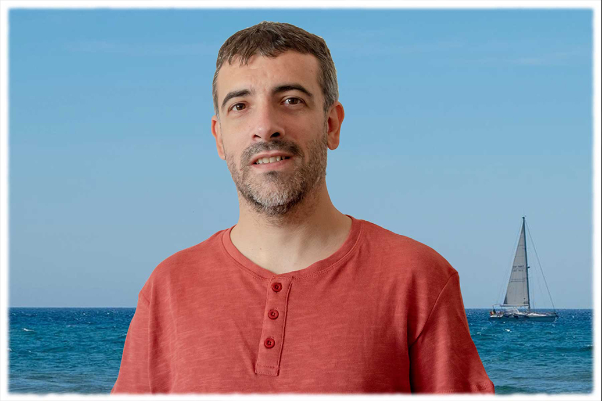

<h2>Hi, I'm Javier Ruano, Front End Developer</h2>



### About Me

My name is Javi and at 37 years old I am still fascinated by technology and teamwork. Currently, working through Agile methodology with the latest technologies such as Angular, TypeScript, RxJs, Angular Material, Sass, HTML5, JSON ... in which I am comfortable on the Front development side. Not forgetting the old but great JavaScript, jQuery that I learned from the beginning.

I have developed projects for different companies, in which I have been able to work side by side with great professionals, developing from small applications to large projects in which version control ("Thanks Git for arriving! 😀") is essential, working from the technical designs to layout and full application development from scratch.

I have also worked with Back technologies such as NodeJs, MongoDB, Java, SpringBoot, maven, REST since someone has to bring us the desired data to the Front. 😉

<p>
<em>My personal WebSite: <a href="https://www.jruano.com" target="_blank">jruano.com</a></em>
<br/>
<em><a href="https://www.linkedin.com/in/javierruano" target="_blank">Linkedin</a></em>
<br/>
<em><a href="https://twitter.com/jruanofreelance" target="_blank">Twitter</a></em>
</p>

### A little code information about me...  

```javascript
const JRUANO = {
  code: [JavaScript, TypeScript, Sass, CSS, HTML5, Java],
  frameworks: [Angular, Node, Spring Boot, Maven],
  libraries: [RxJs, Angular Material, JQuery],
  BDs: [MongoDB, MySql]
  IDs: [VSCode, Spring],
  design: [Photoshop],
  patterns: [MVVM, MVC]
}
```